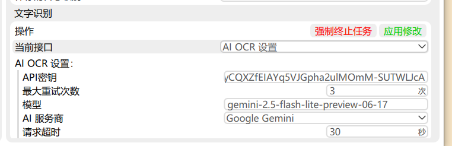

# Umi-OCR Gemini Plugin

## 目前该插件遇到一些问题
### 1、OCR后的文字与原图文字无法对齐，试过很多坐标方法、缩放方法，都解决不了，这是通过API进行OCR的底层逻辑导致的，暂时无法解决
### 2、进行多图识别时，容易出现API调用失败的问题，该问题可能与UMI-OCR本身软件是排队识别有关系，暂时也没法解决。
### 因此，还是等待原作者自己退出的AI模型插件吧，如果你的要求不高，可以使用本插件处理一些复杂的OCR，如果遇到需要批量进行的OCR，本插件并不适合。

[](https://github.com/hiroi-sora/Umi-OCR)
[](LICENSE)
[](https://www.python.org/)
[](https://ai.google.dev/)

## 关于 Umi-OCR

**Umi-OCR** 是一款免费、开源、可批量的离线OCR软件，基于 PaddleOCR 开发。它具有以下特点：

- 🆓 **完全免费**：无需付费，无广告，开源软件
- 📱 **界面友好**：现代化的图形界面，操作简单直观
- 🔄 **批量处理**：支持批量图片OCR，提高工作效率
- 🌐 **多语言支持**：支持中文、英文、日文、韩文等多种语言
- 🔌 **插件系统**：支持扩展插件，功能可定制
- 💻 **跨平台**：支持Windows、Linux等操作系统

**项目地址**：[https://github.com/hiroi-sora/Umi-OCR](https://github.com/hiroi-sora/Umi-OCR)

## 关于本插件

本插件为 Umi-OCR 提供基于 Google Gemini API 的云端OCR功能，作为离线OCR的补充和增强。通过集成最新的 Gemini 视觉模型，为用户提供更高精度的文字识别服务。

### 为什么选择 Gemini OCR 插件？

- **🎯 精度提升**：利用Google最先进的多模态AI模型
- **🌍 语言覆盖**：支持更多语言和复杂文档格式
- **🔄 完美集成**：无缝融入Umi-OCR工作流程
- **⚡ 灵活选择**：可根据需要在离线和云端OCR间切换

## 对比识别效果

### 设置界面

### 识别图片：“对于及其复杂的手写信息，也能完美识别”

### PadeleCOR识别效果，结果很差劲

### WechatOCR识别效果，结果很差劲

### Gemini识别效果，非常完美

## 功能特点

| 功能 | 描述 |
|------|------|
| 🚀 **高精度识别** | 基于Google最新的Gemini模型，支持多种语言文字识别 |
| 🌍 **多语言支持** | 支持中文、英文、日文、韩文、法文、德文、西班牙文、俄文、阿拉伯文等 |
| ⚡ **多模型选择** | 支持Gemini 2.5 Flash（推荐）、Gemini 1.5 Pro等多种模型 |
| 📍 **坐标提取** | 可选择输出文字的位置坐标信息 |
| 🔧 **灵活配置** | 支持图像质量、尺寸、超时等多项参数调整 |
| 🌐 **代理支持** | 支持HTTP代理，适应不同网络环境 |
| 🔄 **智能重试** | 自动重试机制，提高识别成功率 |

## 安装要求

1. **Umi-OCR软件**：需要安装 [Umi-OCR](https://github.com/hiroi-sora/Umi-OCR) v2.0+
2. **Google Gemini API密钥**：需要在 [Google AI Studio](https://aistudio.google.com/app/apikey) 获取API密钥
3. **网络连接**：需要能够访问Google API服务
4. **Python依赖**：`google-genai` 库（可选，有备用方案）

## 安装步骤

### 方法一：直接下载

1. 下载本项目的所有文件
2. 将整个 `GeminiOCR` 文件夹复制到 Umi-OCR 的插件目录：
   ```
   UmiOCR-data/plugins/GeminiOCR/
   ```
3. 重启 Umi-OCR 软件
4. 在OCR引擎选择中找到 "Gemini OCR（云端）"

### 方法二：Git克隆

```bash
cd UmiOCR-data/plugins/
git clone https://github.com/EatWorld/Umi-OCR-Gemini-Plugin.git GeminiOCR
```

详细安装说明请参考：[INSTALL.md](INSTALL.md)

## 配置说明

### 全局配置

| 配置项 | 说明 | 推荐值 |
|--------|------|--------|
| **API密钥** | Google AI Studio获取的API密钥 | 必填 |
| **模型选择** | Gemini模型版本 | `gemini-2.5-flash-preview-05-20` |
| **请求超时** | API请求的超时时间 | 30秒 |
| **重试次数** | 请求失败时的重试次数 | 3次 |
| **代理地址** | HTTP代理设置（可选） | 按需配置 |

> ⚠️ **重要提示**：模型名称可能会更新，请访问 [Google Gemini API 官方文档](https://ai.google.dev/gemini-api/docs/models/gemini) 查看最新的可用模型列表。

#### 可用模型说明

- **gemini-2.5-flash-preview-05-20**：最新预览版本，速度快，精度高（推荐）
- **gemini-1.5-flash**：稳定版本，速度快，适合批量处理
- **gemini-1.5-pro**：高精度版本，适合重要文档
- **gemini-1.5-flash-8b**：轻量版本，成本更低

### 局部配置

| 配置项 | 说明 | 选项 |
|--------|------|------|
| **识别语言** | 指定文字语言可提高识别精度 | 中文/英文/日文/韩文等 |
| **输出格式** | 识别结果的输出格式 | 仅文本/文本+坐标 |
| **图像质量** | 影响识别精度和传输速度 | 自动/高/中/低 |
| **最大图像尺寸** | 控制上传图像的大小 | 1024/2048/4096像素 |

## 使用方法

### 1. 获取API密钥

1. 访问 [Google AI Studio](https://aistudio.google.com/app/apikey)
2. 登录Google账号
3. 创建新的API密钥
4. 复制生成的API密钥

### 2. 配置插件

1. 在Umi-OCR中选择 "Gemini OCR（云端）"
2. 在全局设置中输入API密钥
3. 选择合适的模型（推荐 `gemini-2.5-flash-preview-05-20`）
4. 根据需要调整其他参数

### 3. 开始识别

- 使用截图OCR、批量OCR等功能
- 插件会自动调用Gemini API进行识别
- 支持与本地OCR引擎混合使用

## 效果展示

<!-- 这里可以添加识别效果的截图 -->
*识别效果图片待添加*

## 注意事项

1. **API成本**：Gemini API按使用量计费，请注意控制使用频率
2. **网络要求**：需要稳定的网络连接访问Google服务
3. **图像大小**：建议设置合适的最大图像尺寸以控制成本
4. **隐私安全**：图像会上传到Google服务器进行处理
5. **速度限制**：云端API可能有速度限制，不适合大量并发请求

## 故障排除

### 常见问题

| 问题 | 可能原因 | 解决方案 |
|------|----------|----------|
| API密钥无效 | 密钥错误或过期 | 检查密钥是否正确，确认权限和配额 |
| 网络连接失败 | 网络问题 | 检查网络连接，尝试配置代理 |
| 识别结果为空 | 图像质量问题 | 检查图像清晰度，调整质量设置 |
| 请求超时 | 网络延迟 | 增加超时时间，减小图像尺寸 |
| 模型不存在 | 模型名称错误 | 检查模型名称是否正确 |

### 错误代码说明

- `code: 100`：识别成功
- `code: 200`：识别失败，错误信息在data字段中

### 获取帮助

如遇到问题，请检查：
1. Umi-OCR版本是否兼容
2. API密钥是否有效
3. 网络连接是否正常
4. 插件文件是否完整
5. 模型名称是否正确

## 开发资源

- **Umi-OCR项目**：[https://github.com/hiroi-sora/Umi-OCR](https://github.com/hiroi-sora/Umi-OCR)
- **Google Gemini API文档**：[https://ai.google.dev/gemini-api/docs/models/gemini](https://ai.google.dev/gemini-api/docs/models/gemini)
- **API密钥获取**：[https://aistudio.google.com/app/apikey](https://aistudio.google.com/app/apikey)

## 版本历史

- **v1.2.0**：支持Gemini 2.5 Flash和Pro预览版模型，优化识别精度
- **v1.1.0**：增加多语言支持，优化错误处理
- **v1.0.0**：初始版本，支持基本OCR功能

## 许可证

本插件遵循 MIT 许可证。详见 [LICENSE](LICENSE) 文件。

## 贡献

欢迎提交Issue和Pull Request来改进这个插件！

## 支持

如果这个插件对您有帮助，请考虑给项目点个星⭐！
