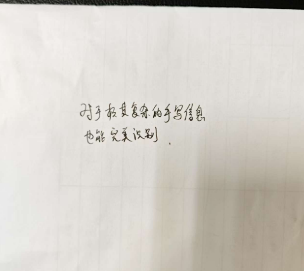
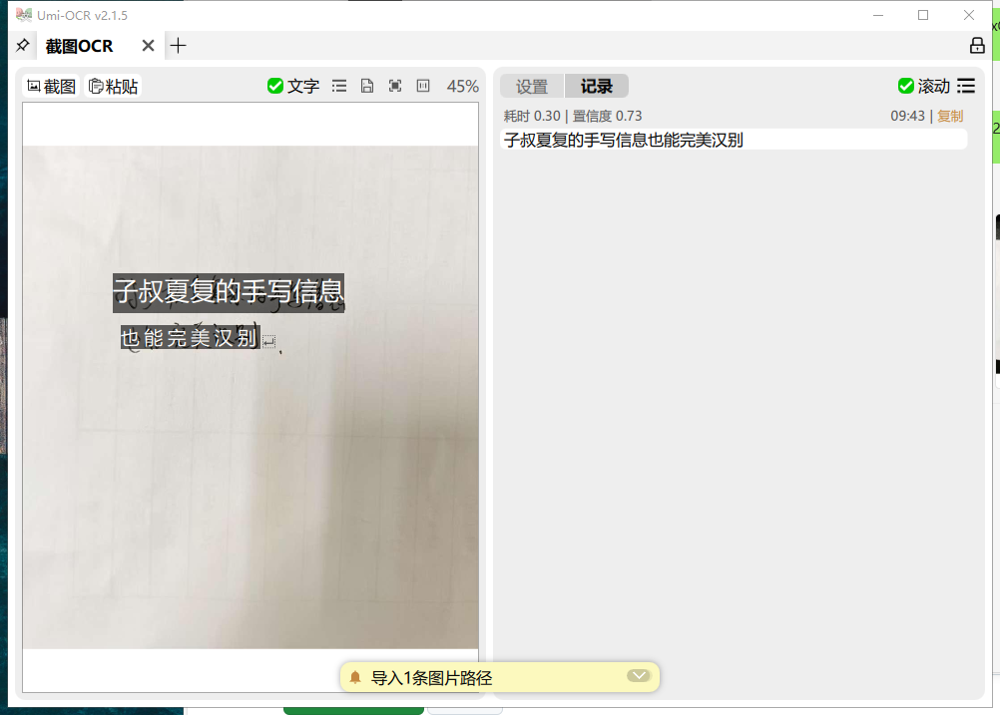
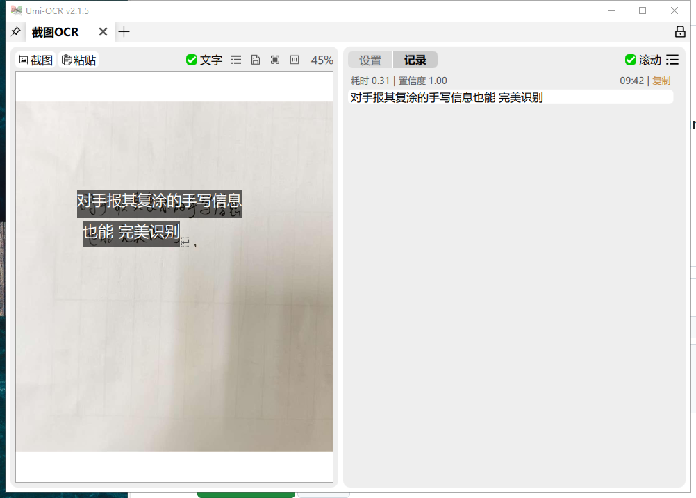
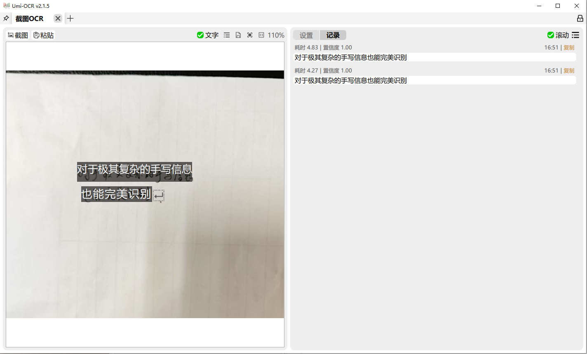

# Umi-OCR AI OCR 插件

## 🚀 项目简介

本插件为 **Umi-OCR** 提供 **13个主流AI服务商** 的OCR功能，支持云端和本地AI服务的视觉识别API。作为离线OCR的强力补充，为用户提供更高精度、更广泛语言支持的智能文字识别服务。


## 🌟 支持的 AI 服务商

### 🌐 云端服务商
| 服务商 | 建议模型 | 特点 |
|--------|----------|------|
| **硅基流动 (SiliconFlow)** | Qwen/Qwen2.5-VL-32B-Instruct | 开源模型多，价格低，速度快，准确率超高，**最推荐** |
| **阿里云百炼 (Alibaba)** | qwen-vl-plus-2025-08-15 | 专业OCR模型，中文识别优秀 |
| **智谱AI (ZhipuAI)** | glm-4.5v | 国产大模型，多模态能力强 |
| **豆包(Doubao)** | Doubao-1.5-vision-pro-32k | 中文优化效果好，性价比高 |
| **OpenAI** | gpt-5-mini | 高精度，多语言支持 |
| **Google Gemini** | gemini-2.5-flash | 速度快，成本低 |
| **xAI Grok** | grok-4 | 创新模型，独特优势 |
| **OpenRouter** | anthropic/claude-3.5-sonnet | 统一接口，模型丰富 |
| **Groq** | llama-3.3-70b-versatile | 高性能推理，速度极快 |
| **魔搭 (ModelScope)** | Qwen/Qwen-VL-Plus | 阿里达摩院开源平台，模型丰富 |
| **无问芯穹 (Infinigence)** | kimi-k2-instruct | 月之暗面AI平台，长文本处理强 |
| **Mistral AI** | pixtral-12b-2409 | 欧洲AI公司，视觉模型优秀 |
| **浦源书生 (Intern)** | internvl3.5-241b-a28b | 学术界AI平台，多模态能力强 |

### 🏠 本地服务商（离线识别）
| 服务商 | 建议模型 | 特点 |
|--------|----------|------|
| **Ollama** | llava, llava:7b, bakllava | 🔒 **完全离线**，隐私保护，免费使用，**支持自定义地址** |
| **LM Studio** | llava, llava-1.5-7b-hf | 🔒 **完全离线**，图形界面友好，OpenAI兼容，**支持自定义地址** |

> 💡 **自定义地址功能**：Ollama 和 LM Studio 支持自定义 API 地址，您可以：
> - 🌐 连接到局域网内其他机器上的 Ollama/LM Studio 服务
> - ⚡ 在配置较低的机器上运行 Umi-OCR，连接到高性能机器上的 AI 服务  
> - 🔧 灵活部署，充分利用现有硬件资源
> - 📡 支持远程AI服务，实现分布式OCR处理


## 📋 关于 Umi-OCR

**Umi-OCR** 是一款免费、开源、可批量的离线OCR软件，基于 PaddleOCR 开发。它具有以下特点：

[](https://github.com/hiroi-sora/Umi-OCR)
[](LICENSE)
[](https://www.python.org/)
[]()

- 🆓 **完全免费**：无需付费，无广告，开源软件
- 📱 **界面友好**：现代化的图形界面，操作简单直观
- 🔄 **批量处理**：支持批量图片OCR，提高工作效率
- 🌐 **多语言支持**：支持中文、英文、日文、韩文等多种语言
- 🔌 **插件系统**：支持扩展插件，功能可定制
- 💻 **跨平台**：支持Windows、Linux等操作系统

**项目地址**：[https://github.com/hiroi-sora/Umi-OCR](https://github.com/hiroi-sora/Umi-OCR)

## 🎯 插件特色

### 为什么选择多厂商 AI OCR 插件？

- **🎯 精度提升**：利用最先进的多模态AI模型
- **🌍 语言覆盖**：支持更多语言和复杂文档格式
- **🔄 完美集成**：无缝融入Umi-OCR工作流程
- **⚡ 灵活选择**：可根据需要在离线和云端OCR间切换
- **🏢 多厂商支持**：避免单一依赖，提供更多选择
- **🔒 隐私保护**：支持本地离线识别，数据不上传
- **💰 成本控制**：本地服务免费，云端服务按需选择

## 📊 对比识别效果

### 设置界面


### 识别图片："对于及其复杂的手写信息，也能完美识别"


### PaddleOCR识别效果，结果很差劲


### WechatOCR识别效果，结果很差劲


### AI OCR(模型：gemini 2.5 flash)识别效果，非常完美


## ✨ 功能特点

| 功能 | 描述 |
|------|------|
| 🚀 **高精度识别** | 基于最新的AI视觉模型，支持多种语言文字识别 |
| 🌍 **多语言支持** | 支持中文、英文、日文、韩文、法文、德文、西班牙文、俄文、阿拉伯文等 |
| ⚡ **多厂商选择** | 支持OpenAI、Gemini、xAI、OpenRouter、硅基流动、豆包等多个服务商 |
| 📍 **坐标提取** | 可选择输出文字的位置坐标信息 |
| 🔧 **灵活配置** | 支持图像质量、尺寸、超时等多项参数调整 |
| 🌐 **代理支持** | 支持HTTP/SOCKS5代理，适应不同网络环境 |
| 🔄 **智能重试** | 自动重试机制，提高识别成功率 |
| 🚀 **并发处理** | 支持批量图片并发识别，提高处理效率 |

## 📦 安装要求

1. **Umi-OCR软件**：需要安装 [Umi-OCR](https://github.com/hiroi-sora/Umi-OCR) v2.0+
2. **AI服务API密钥**：需要获取对应服务商的API密钥
3. **网络连接**：需要能够访问对应的AI服务，国外模型通常需要魔法上网才行

## 🛠️ 安装步骤

1. 下载本项目的所有文件
2. 将整个 `AIOCR` 文件夹复制到 Umi-OCR 的插件目录：
   ```
   UmiOCR-data/plugins/
   ```
3. 重启 Umi-OCR 软件
4. 在OCR引擎选择中找到 "AI OCR（云端）"


## ⚙️ 配置说明


### 1. 配置插件

**首次配置（推荐一次性配置所有服务商）**：
1. 在Umi-OCR中选择 "AI OCR（云端）"
2. 在全局设置中配置所有你要使用的服务商：
   - 填写 OpenAI API密钥和模型（如需要）
   - 填写 Gemini API密钥和模型（如需要）
   - 填写其他服务商的配置（如需要）
3. 选择当前要使用的AI服务商并点击**应用修改**

**日常使用**：
- 只需在"当前AI服务商"下拉菜单中切换并点击**应用修改**即可
- 无需重新输入API密钥和模型
- 所有配置都会自动保存

### 2. 开始识别

- 使用截图OCR、批量OCR等功能
- 插件会自动调用对应的AI API进行识别

## 🆕 新增功能（v2.6.0）
- 识别后的文字与原图位置几乎零偏差，行间对齐更稳定。
- 内置坐标对齐与框修正，无需理解原理即可直接使用。
- 与“检测-识别双通道”配合，速度与准确位置同时兼顾。

## 🚀 启用双通道识别（推荐）
- 位置：打开插件“AI OCR（云端）”→ 设置面板，勾选`启用检测-识别双通道`。
- 推荐参数（可按需微调）：
  - `裁剪边缘补白`：`2 px`
  - `本地高置信度直接采用`：`0.92`
  - `双通道最大识别框数`：`30`
  - `双通道并发识别数`：`3`（性能好可设为 `4–6`）
  - `双通道最小框面积`：`0`（默认值，避免漏掉小字）
- 效果：在保证坐标对齐的前提下，整图识别速度可降至约`10s`。
- 如图所示，请按上述数值进行设置；其余保持默认即可。

## ⚠️ 注意事项

1. **API成本**：AI API按使用量计费，请注意控制使用频率
2. **网络要求**：需要稳定的网络连接访问AI服务
3. **图像大小**：建议设置合适的最大图像尺寸以控制成本
4. **隐私安全**：图像会直接上传到服务商服务器进行处理，插件作者不会得到你的任何图片和信息
5. **速度限制**：云端API可能有速度限制，不适合大量并发请求
6. **模型选择**：不同模型的精度和成本不同，请根据需求选择


## 🔑 API密钥获取

### 硅基流动 (SiliconFlow)
1. 访问 [硅基流动](https://cloud.siliconflow.cn/)
2. 注册账号并获取API密钥
3. 支持多种开源视觉模型

### 豆包 (Doubao)
1. 访问 [火山引擎](https://console.volcengine.com/ark/)
2. 开通豆包服务并获取API密钥
3. 字节跳动自研多模态模型

### OpenAI
1. 访问 [OpenAI Platform](https://platform.openai.com/api-keys)
2. 登录账号并创建API密钥
3. 复制生成的密钥

### Google Gemini
1. 访问 [Google AI Studio](https://aistudio.google.com/app/apikey)
2. 登录Google账号
3. 创建新的API密钥

### xAI Grok
1. 访问 [xAI Console](https://console.x.ai/)
2. 注册并获取API密钥

### 阿里云百炼 (Alibaba)
1. 访问 [阿里云百炼平台](https://bailian.console.aliyun.com/)
2. 开通百炼服务并获取API密钥
3. 支持通义千问系列视觉模型

### 智谱AI (ZhipuAI)
1. 访问 [智谱AI开放平台](https://open.bigmodel.cn/)
2. 注册账号并创建API密钥
3. 国产大模型，多模态能力强

### OpenRouter
1. 访问 [OpenRouter](https://openrouter.ai/keys)
2. 注册账号并创建API密钥

### Groq
1. 访问 [Groq Console](https://console.groq.com/)
2. 注册账号并获取API密钥
3. 高性能推理平台，速度极快

### 魔搭 (ModelScope)
1. 访问 [魔搭社区](https://www.modelscope.cn/)
2. 注册账号并获取访问令牌 (Access Token)
3. 阿里达摩院开源AI平台

### 无问芯穹 (Infinigence)
1. 访问 [无问芯穹平台](https://cloud.infini-ai.com/)
2. 注册账号并获取API密钥
3. 月之暗面AI平台，长文本处理能力强

### Mistral AI
1. 访问 [Mistral Platform](https://console.mistral.ai/)
2. 注册账号并创建API密钥
3. 欧洲AI公司，视觉模型优秀

### 浦源书生 (Intern)
1. 访问 [书生·浦语平台](https://chat.intern-ai.org.cn/)
2. 注册账号并获取API密钥
3. 学术界AI平台，多模态能力强

## 🏠 本地服务安装指南

### Ollama (完全离线)
1. **安装Ollama**：
   ```bash
   # Linux/macOS
   curl -fsSL https://ollama.ai/install.sh | sh
   
   # Windows
   # 从 https://ollama.ai 下载安装包
   ```

2. **下载视觉模型**：
   ```bash
   # 下载llava模型（推荐）
   ollama pull llava
   
   # 或下载其他视觉模型
   ollama pull llava:7b
   ollama pull bakllava
   ```

3. **启动服务**：
   ```bash
   ollama serve
   # 服务将在 http://localhost:11434 启动
   ```

4. **在插件中配置**：
   - 服务商：选择 "Ollama (本地)"
   - 模型：填入已下载的模型名（如 llava）
   - 默认API地址（可修改）：http://localhost:11434/api
   - API密钥：留空即可

### LM Studio (图形界面)
1. **下载安装**：
   - 访问 [LM Studio官网](https://lmstudio.ai/)
   - 下载并安装适合您系统的版本

2. **下载模型**：
   - 在LM Studio中搜索并下载支持视觉的模型
   - 推荐：`llava-1.5-7b-hf`, `llava-1.6-34b-hf`

3. **启动本地服务器**：
   - 在LM Studio中点击"本地服务器"
   - 选择已下载的视觉模型
   - 启动服务器（默认端口1234）

4. **在插件中配置**：
   - 服务商：选择 "LM Studio (本地)"
   - 模型：填入LM Studio中加载的模型名
   - 默认API地址（可修改）：http://localhost:1234/v1
   - API密钥：留空或填入"not-needed"

### 🔒 本地服务优势
- **完全离线**：无需网络连接，数据不上传
- **隐私保护**：所有处理在本地完成
- **免费使用**：无API调用费用
- **自主控制**：可选择和定制模型


## 🔧 故障排除

### 常见问题

| 问题 | 可能原因 | 解决方案 |
|------|----------|----------|
| API密钥无效 | 密钥错误或过期 | 检查密钥是否正确，确认权限和配额 |
| 网络连接失败 | 网络问题 | 检查网络连接，尝试配置代理 |
| 识别结果为空 | 图像质量问题 | 检查图像清晰度，调整质量设置 |
| 请求超时 | 网络延迟 | 增加超时时间，减小图像尺寸 |
| 模型不存在 | 模型名称错误 | 检查模型名称是否正确 |
| 服务商不可用 | 服务商问题 | 尝试切换到其他服务商 |


### 获取帮助

如遇到问题，请检查：
1. Umi-OCR版本是否兼容
2. API密钥是否有效
3. 网络连接是否正常
4. 插件文件是否完整
5. 模型名称是否正确
6. 服务商服务是否正常


## 📝 版本历史
- **v2.6.0**：定位对齐“几乎零偏差”，新增并完善双通道识别；默认最小框面积设为0并为遗漏框追加本地结果兜底；并发识别、框数限制、本地高分直接采用、裁剪补白等参数可调，整图识别速度由近2分钟降至约10秒。
- **v2.5.0**：🎉 **社区贡献更新** - 新增5个AI服务商支持！添加Groq（高性能推理）、魔搭ModelScope（阿里达摩院）、无问芯穹Infinigence（月之暗面）、Mistral AI（欧洲AI）、浦源书生Intern（学术界AI），大幅扩展AI服务商选择。优化本地服务自定义地址功能。
- **v2.4.0**：🚀 **重大更新** - 新增本地离线识别支持！添加Ollama、LM Studio本地服务商，支持自定义API地址，完全离线OCR成为可能。优化识别文字对齐，现在识别后的文字与原图位置只有轻微偏移。
- **v2.3.0**：新增阿里云百炼和智谱AI支持，更新所有服务商默认模型，优化界面布局，移除重试次数配置（内置3次）
- **v2.2.0**：支持一次性配置所有服务商，切换时无需重新输入API密钥和模型
- **v2.1.0**：增加支持硅基流动、豆包视觉模型
- **v2.0.0**：重构为多厂商AI OCR插件，支持OpenAI、Gemini、xAI、OpenRouter
- **v1.2.0**：支持Gemini 2.5 Flash和Pro预览版模型，优化识别精度
- **v1.1.0**：增加多语言支持，优化错误处理
- **v1.0.0**：初始版本，支持Gemini OCR功能


## 💖 支持

如果这个插件对您有帮助，请考虑：

- 给项目点个星⭐
- 分享给更多需要的人
- 提供反馈和建议
- 参与项目贡献

---

**感谢使用 Umi-OCR 多厂商 AI OCR 插件！**
